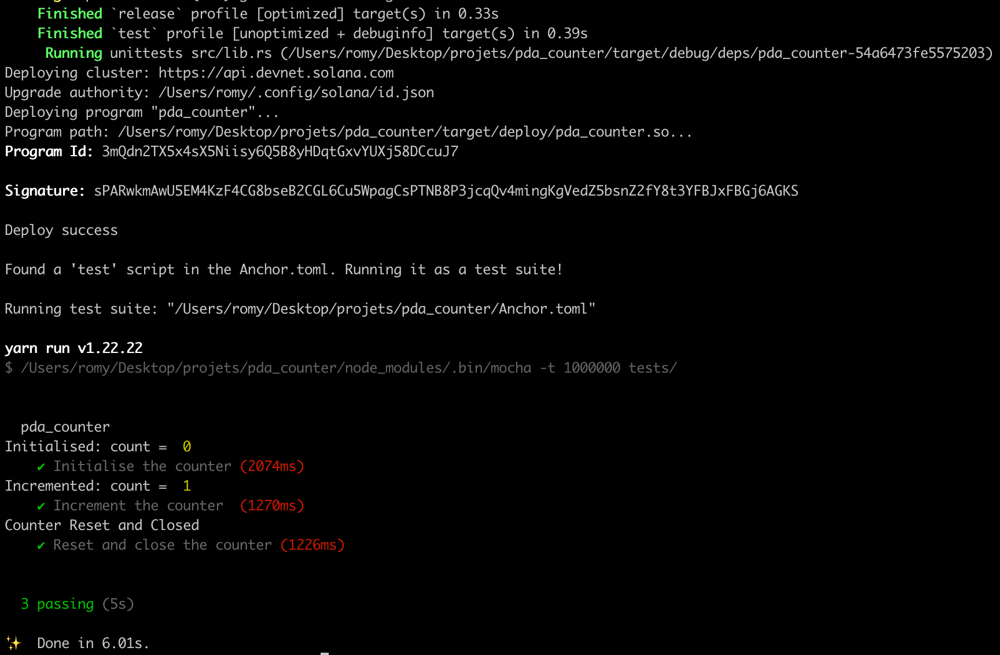

# PDA Counter — Solana Anchor Project

Version: 0.1.0  
License: MIT

This project is a minimal smart contract on the Solana blockchain, built using the Anchor framework. It allows users to create and manage their own on-chain counter using a Program Derived Address (PDA). Each counter is tied to a specific user and supports incrementing, resetting, and automatic closure.

---

## Features

- Create a PDA counter account tied to a user's wallet
- Increment the counter securely with access control
- Reset and close the account to reclaim rent
- Events emitted for each operation (initialize, increment, reset)
- Anchor-based Rust smart contract with JavaScript test suite

---

## Stack

- Solana (devnet)
- Rust (Anchor framework)
- JavaScript (Mocha + Anchor testing utilities)

---

## How to Run

1. Install dependencies:

   yarn install

2. Build the program:

   anchor build

3. Deploy to devnet (optional):

   anchor deploy

   Make sure your wallet is funded:

   solana airdrop 2

4. Run the test suite:

   anchor test

   This will:
   - Derive a PDA for your wallet
   - Initialize the counter
   - Increment it
   - Reset and close the account
   - Confirm the account is closed

## Example Test Output

Below is a screenshot of the successful test run using `anchor test`:

---

## Folder Structure

pda_counter  
├── programs/  
│   └── pda_counter/        Rust smart contract  
│       └── src/lib.rs  
├── tests/  
│   └── pda_counter.js      JavaScript test suite  
├── Anchor.toml             Anchor config  
├── Cargo.toml              Workspace config  
├── package.json            JS dependencies and scripts  
├── LICENSE                 MIT license  
└── README.md               This file  

---

## Smart Contract Logic

- `initialize`: Creates a new counter PDA with the caller as the owner.
- `increment`: Increases the counter by one. Only the owner can call this.
- `reset`: Resets the counter and closes the account, returning rent to the user.
- Each function emits an event for tracking on-chain state changes.

---

## PDA Details

Each user’s counter is stored at a deterministic PDA derived using:

Seed: "counte"  
Key: [ "counte", user public key ]  
Bump: Automatically computed by Anchor

Note: The seed "counte" (not "counter") was used to avoid PDA conflicts during testing.

---

## License

This project is licensed under the MIT License. See the LICENSE file for details.

---

## Summary

This is a clean example of a complete Solana program using Anchor. It demonstrates:
- PDA account creation and access control
- Basic instruction handling
- Event emission
- JavaScript-based testing with Anchor

The project can serve as a learning reference or a base for more advanced Solana applications.

---

## Author

Maintained by [Adarsh](https://github.com/Webrowse)
